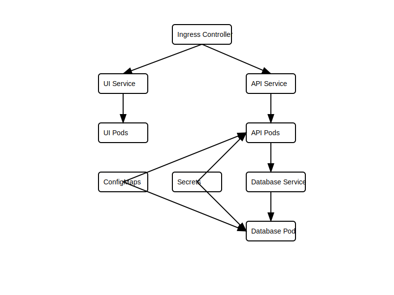
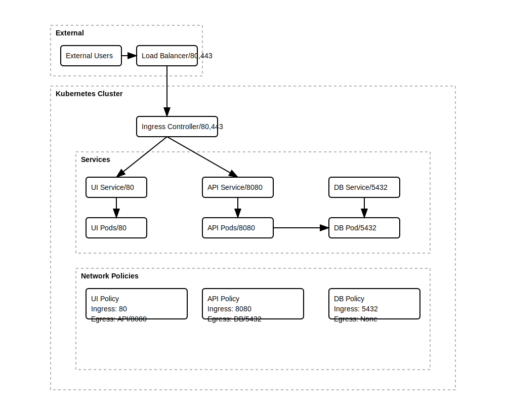
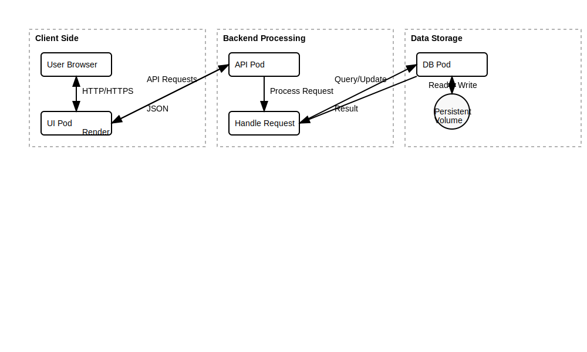

# DevOps Documentation for Multi-Tier Kubernetes Application

## 1. Requirement Understanding

### Core Infrastructure Requirements
- Containerized microservices architecture
- High availability and fault tolerance
- Scalable deployment infrastructure
- Service discovery and load balancing
- Automated deployment and rollback capabilities
- Resource management and optimization
- Monitoring and observability
- Data persistence and backup management

### Operational Requirements
- Zero-downtime deployments
- Automated health checks and self-healing
- Resource isolation between services
- Configurable resource limits and requests
- Easy horizontal scaling
- Centralized logging and monitoring
- Infrastructure as Code (IaC) implementation
- Secure secret management

## 2. Assumptions

### Infrastructure Assumptions
- Kubernetes cluster is available and properly configured
- Helm v3.x is installed for package management
- Ingress controller can be deployed in the cluster
- Persistent storage is available for stateful workloads
- Network policies allow inter-service communication
- DNS resolution works correctly within the cluster

### Operational Assumptions
- Docker images are built and available in a registry
- CI/CD pipeline has necessary permissions for deployments
- Monitoring and logging infrastructure exists
- Backup storage is available for persistent data
- Team has necessary RBAC permissions in the cluster
- Network allows external access through Ingress

## 3. Solution Overview

### Infrastructure Components

#### 1. Container Orchestration
- **Platform**: Kubernetes
- **Package Manager**: Helm v3
- **Deployment Strategy**: Rolling updates
- **Service Mesh**: Native Kubernetes services

#### 2. Ingress Management
- **Controller**: NGINX Ingress Controller
- **Configuration**: Path-based routing
- **SSL/TLS**: Configurable (recommended for production)

#### 3. Storage Management
- **Type**: Persistent Volumes (PV)
- **Provisioner**: Dynamic provisioning
- **Storage Class**: Default storage class
- **Backup**: Volume snapshots (recommended for production)

#### 4. Service Discovery
- **Method**: Kubernetes Services
- **Type**: ClusterIP (internal), LoadBalancer (external)
- **DNS**: CoreDNS (Kubernetes native)

### Architecture Diagrams

#### 1. Deployment Architecture

The deployment architecture diagram shows the relationship between different components in the Kubernetes cluster, including services, pods, ConfigMaps, and Secrets.

#### 2. Network Flow Architecture

The network flow architecture diagram illustrates the network topology, including port mappings, ingress rules, and network policies between components.

#### 3. Data Flow Architecture

The data flow architecture diagram shows the request-response cycle and data persistence flow between components.

## 4. Resource Utilization Justification

### Compute Resources

#### API Service
- **CPU**: 0.2-1.0 cores
  - *Justification*: Handles business logic and database operations
  - *Scaling*: CPU-based HPA for dynamic workloads
- **Memory**: 256Mi-512Mi
  - *Justification*: Required for in-memory operations and connection pooling
  - *Scaling*: Memory-based HPA available

#### UI Service
- **CPU**: 0.1-0.5 cores
  - *Justification*: Static content serving with minimal computation
  - *Scaling*: Based on concurrent user sessions
- **Memory**: 128Mi-256Mi
  - *Justification*: Nginx process and static file caching
  - *Scaling*: Minimal memory footprint required

#### Database
- **CPU**: 0.5-1.0 cores
  - *Justification*: Database operations and indexing
  - *Scaling*: Vertical scaling recommended
- **Memory**: 512Mi-1Gi
  - *Justification*: Query cache and connection pool
  - *Scaling*: Based on data size and concurrent connections
- **Storage**: 0.5Gi
  - *Justification*: Initial data storage capacity
  - *Scaling*: Volume expansion supported

### High Availability Configuration

#### Replication Strategy
- **API**: 2-5 replicas
  - *Justification*: Ensures high availability and load distribution
- **UI**: 2-3 replicas
  - *Justification*: Provides redundancy and load balancing
- **Database**: Single instance with backup
  - *Justification*: Stateful workload with data persistence

#### Pod Anti-Affinity
- Ensures pods are distributed across nodes
- Prevents single node failure affecting all replicas

### Network Configuration

#### Ingress Controller
- Handles external traffic routing
- SSL/TLS termination
- Rate limiting capabilities
- Path-based routing to services

#### Service Configuration
- Internal services: ClusterIP
- Database: ClusterIP (no external access)
- Health check endpoints configured
- Readiness/Liveness probes implemented

## 5. Monitoring and Maintenance

### Health Monitoring
- Readiness probes for service availability
- Liveness probes for application health
- Resource utilization monitoring
- Pod lifecycle monitoring

### Logging Strategy
- Container logs collected centrally
- Application logs structured in JSON
- Audit logs for security monitoring
- Log retention policies implemented

### Backup Strategy
- Database backups automated
- PV snapshots for data protection
- Configuration backups
- Disaster recovery plan documented

### Scaling Strategy
- Horizontal Pod Autoscaling (HPA) configured
- Resource quotas implemented
- Node autoscaling recommended
- Manual scaling supported

## 6. Security Measures

### Access Control
- RBAC implemented for service accounts
- Network policies for pod isolation
- Secret management using Kubernetes Secrets
- Service mesh authentication (optional)

### Data Protection
- Encrypted secrets at rest
- TLS for in-transit encryption
- Regular security audits
- Vulnerability scanning for containers

## 7. Production Recommendations

### Additional Considerations
1. Implement proper monitoring solution (e.g., Prometheus + Grafana)
2. Set up alerting for critical metrics
3. Configure automated backup solution
4. Implement proper CI/CD pipeline
5. Set up proper logging aggregation
6. Configure SSL/TLS certificates
7. Implement proper network policies
8. Set up proper disaster recovery plan